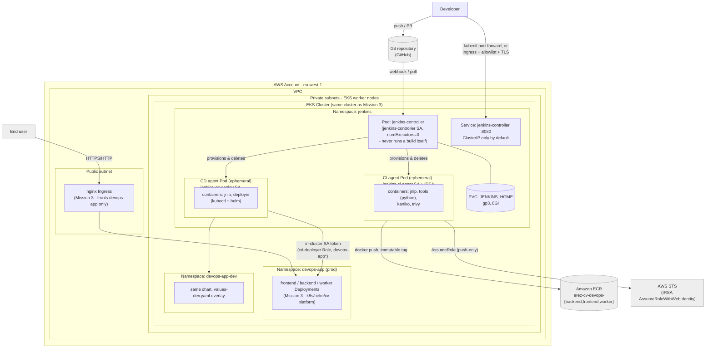

# Jenkins CI/CD Architecture

Two complementary views, as recommended by the Mission 4 spec: a
**Deployment View** (where things run) and a **Pipeline Flow** (the
logical order of events from commit to running application). Both are
embedded in [jenkins/README.md](README.md) as required; this file is the
Mermaid source.

Same EKS cluster as [k8s/architecture-diagram.md](../k8s/architecture-diagram.md)
(Mission 3) - Jenkins runs in its own `jenkins` namespace alongside, not
instead of, `devops-app` / `devops-app-dev`. See jenkins/README.md
"Where Jenkins runs" for why one cluster was chosen over two.

## Deployment View

## Pipeline Flow

```mermaid
flowchart LR
    A["git push to main"] --> B["Webhook (or 5-min poll fallback)<br/>fires ci-application"]
    B --> C["Checkout<br/>(container: tools)"]
    C --> D["Validate + Lint + Unit Tests<br/>(container: tools)"]
    D -->|pass| E["Build + Tag + Push<br/>(container: kaniko)<br/>tag = shortSHA-bBUILD_NUMBER"]
    D -->|fail| X1["Build FAILED<br/>cd-application NOT triggered"]
    E --> F["Trivy scan<br/>(container: trivy)<br/>CRITICAL+fixable = fail"]
    F -->|pass| G["Publish image-metadata.json<br/>(tag + digest, archived)"]
    F -->|fail| X1
    G --> H{"branch == main?"}
    H -->|yes| I["build job: cd-application<br/>ENVIRONMENT=dev, IMAGE_TAG=<...>"]
    H -->|no| Z1["CI done - no CD trigger"]

    I --> J["cd-application:<br/>Input + Manifest Validation<br/>(container: deployer)"]
    J -->|invalid tag / bad namespace| X2["Build FAILED<br/>no cluster change"]
    J -->|ok, ENVIRONMENT=prod only| K["Manual approval gate"]
    J -->|ok, dev| L["helm upgrade --install<br/>--atomic --wait"]
    K -->|approved| L
    K -->|timeout/abort| Z2["No deploy - unchanged"]
    L -->|helm/rollout error| M["--atomic auto-rollback<br/>+ events/logs printed"]
    L -->|success| N["kubectl rollout status<br/>x backend/frontend/worker"]
    N --> O["Verify: right image running"]
    O --> P["Smoke test:<br/>backend /health,<br/>backend -> frontend-svc /health"]
    P -->|fail| M
    P -->|pass| Q["CD SUCCESS<br/>version live in target namespace"]

    classDef fail fill:#f8d7da,stroke:#c00;
    class X1,X2,M fail;
    classDef ok fill:#d4edda,stroke:#0a0;
    class Q ok;
```

## What's inside Kubernetes vs. outside it

| Component | Location |
|---|---|
| Jenkins controller, PVC, Service, ServiceAccounts, RBAC, agent Pods | Inside EKS (`jenkins` namespace) |
| Application (frontend/backend/worker), its own RBAC/Secrets/ConfigMaps | Inside EKS (`devops-app` / `devops-app-dev`, from Mission 3) |
| Git repository, ECR, AWS STS/IRSA, RDS, S3, SNS | Outside the cluster (AWS-managed / external SaaS) |
| Jenkins UI access | Not exposed by default (`kubectl port-forward`); optionally Ingress + IP allowlist + TLS - never a bare LoadBalancer |

## Security boundaries (mirrors k8s/architecture-diagram.md's table, extended for Jenkins)

| Zone | Contains | Reachable from |
|---|---|---|
| Public | nginx Ingress (app only) | Internet |
| Internal (cluster) | Jenkins UI Service, agent<->controller JNLP | Only `jenkins` namespace + (optionally) `ingress-nginx` namespace, per jenkins/network-policies/ |
| Private | CD agent -> devops-app/devops-app-dev API calls | Only the `jenkins-cd-deploy` ServiceAccount, scoped by jenkins/rbac/cd-deploy-role*.yaml |
| Credential-holding | jenkins-admin-credentials Secret, IRSA role for jenkins-ci-agent, in-cluster SA token for jenkins-cd-deploy | Jenkins controller Pod only / respective agent Pod only |
