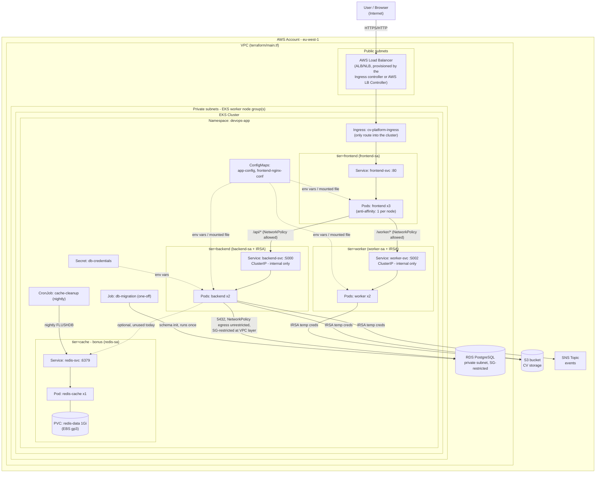

# Kubernetes Architecture

Replaces the EC2 + Ansible topology in [docs/architecture.md](../docs/architecture.md).
Same external services (RDS, S3, SNS), same three application tiers - now
running as Pods in a single EKS cluster/namespace instead of three EC2
instances.

## Security boundaries

| Zone | What lives there | Reachable from |
|---|---|---|
| **Public** | AWS Load Balancer (created by the Ingress controller / AWS LB Controller) | The internet |
| **Private (VPC)** | EKS worker nodes, all Pods, RDS instance | Only the Load Balancer (frontend Pods) and Pods that call out (RDS/S3/SNS) |
| **Internal (cluster-only, NetworkPolicy-enforced)** | backend-svc, worker-svc, redis-svc | Only frontend Pods (backend/worker) and backend/worker Pods (redis) - see `k8s/network-policies/` |

Only the **frontend** tier is reachable from outside the cluster (via
`ingress.yaml` -> `frontend-svc`). backend, worker and redis-cache have no
Ingress, are `type: ClusterIP`, and are further locked down by
`network-policies/` so only the intended caller can reach each one - this is
the concrete answer to "which components are internal and which are exposed"
required by the assignment.

If deployed on EKS: node groups sit in the **private** subnets created by
`terraform/main.tf` (`aws_subnet.private_a/b`); the Load Balancer sits in the
**public** subnets (`aws_subnet.public_a/b`). RDS already lives in a private
subnet group (`aws_db_subnet_group.main`) reachable only from the `app`
security group. S3 and SNS are regional AWS services reached over the
internet gateway/NAT (or, as a hardening step, via VPC Gateway/Interface
Endpoints - see the "Trade-offs" section of `k8s/README.md`).
